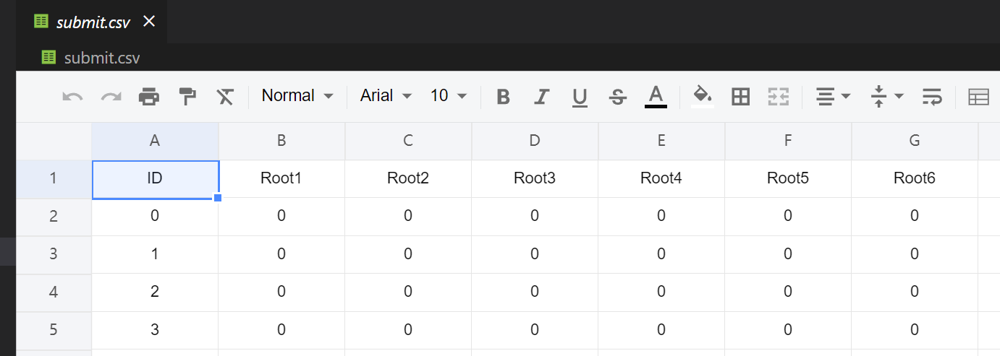

# AIOps 2022 通信网络智能运维大赛

### 大赛网址

<https://www.aiops.sribd.cn/home/statement>

### 场景

华为5G真实业务场景数据集

1. 无线通信环境复杂
2. 网络部署结构复杂
3. 故障样本少
4. 不同场景下故障现象有差异

### 课题

根因定位

1. 需求：根据现有知识，推到已经出现或即将出现的故障
2. 所有的因素之间的影响程度严重依赖于专家经验，灵活性较低。
3. 对一个现象的多个原因进行判断时通常采用独立判断的原则，即缺乏联合考虑。

### 共识

1. 根因定位主要根据变量之间的影响程度确定主要的影响因素，从而推断导致当前现象的主要原因。因此，正确衡量变量之间的关系是根因定位的关键。

2. Y受变量X~1~，X~2~，X~3~影响，当出现故障时，需要分析X~1~，X~2~，X~3~哪个变量对于的影响最大，从而判断主要原因。当前运维过程中，主要通过人工总结经验的方法得到。

    ​​

### 问题阐述

电信网络中feature0值偏低一直是客户关注的问题，本赛题重点解决feature0值偏低的根因定位问题。在已知其值小于200的情况下，我们需要通过分析feature0的影响因素，从而得到其值偏低的原因。

### 数据集描述

##### 数据集概述

1. 变量因果关系图

    ​​

    Figure1: 专家绘制的变量因果关系图

    feature0的影响关系如下图所示，每一个feature可以理解为电信网络中的一个关键绩效指标（KPI），这些KPI的取值随时间变化且相互影响。因此，需要通过图中提供的影响关系，推理出feature0值偏低的最终原因。

    图中的椭圆形表示变量，其中无颜色表示可以采集观测到的数据，灰颜色表示中间计算变量（不可观测），**方框表示对根因的描述**。最上层feature0表示用户关心的结果变量。此关系图不随时间、地点位置发生改变，属于标准的通信协议关系。**变量之间的关系大多为非线性关系。有的是确定性关系，有的为概率性关系。**
2. 变量特征数据

    本数据集共包含2984个样本，每个样本为采自不同的5G路测场景的时间片段（长度不固定），其包含23个可观测特征变量（图1无色椭圆形）在该时间片段内随时间变化的信息。在这2984个样本中，只有少数数据（45%）是标注根因的已知异常数据，其余数据未知。

##### 数据说明

我们采用时间片分析，这意味着我们只需要在时间片级别找到根本原因。例如，表 1 显示了从 **2020-08-18 18:24:40** 到 **2020-08-18 18:25:42 ​**的时间片。数据点每秒记录一次。feature0 的值保持在一定范围内，允许一些抖动。在这里，此时间片中 feature0 的值约为 300。我们根据此时间片中的所有数据点标记根本原因。请注意，多个根本原因也可以同时显示，例如，表 1 中的时间片的根因同时为cause 2和cause 3。

​

**一些备注:**

	1. 数据特征的值可以是连续的也可以是离散的， 必然，feature0是连续的，feature15是离散的。

	2. 一些特征反映了统计信息：例如，feature3_1~feature3_8表示落入对应值1～8的feature3的计数。

	3. 空间特征：例如，feature28_0~28_7表示feature28在方向0 ~ 7上的值。

	4. 时间特征：例如，特征19的波动会导致特征0的行为不稳定。

	5. 不同的数据收集粒度：例如，feature19每几秒报告一次，而feature0每秒记录一次。

注：数据来自不同的场景。在某些情况下，某些功能可能本质上没有任何值，这不是由于缺少集合造成的。

**部分标记的数据：**

	1. 只有部分数据是带标签的：事实上，所有的标签都应该由工程师制作，依靠昂贵的专业知识。许多数据仍然未标记。

	2. 标签并不全面：在 2984 个样本中，我们标记了其中约 45%（可能是多标签）。未标记的样本也可能有缺陷。

##### 数据的特征的细节

|ID|**Variable Name**|**Variable Meaning**|**Variable Property**|
| ----| -------------------------| ---------------------------------------------------------------------------------------------------------------------------------------------------------------------------------| -------------------------------------------------------------------------------------------------------------------------------------------------|
|1|Date & Time|Timestamp|XXXX-XX-XX XX:XX:XX|
|2|feature0|Observed KPI|Continuous value>0|
|3|feature1||discrete value：0~28|
|4|feature2 -||discrete value：normally 0~4|
|5|feature3_m, m=1,2,…8|feature2=mean(m*feature3_m)|Continuous non-negative integer|
|6|feature11||Continuous value :0~100|
|7|feature12||Continuous value :0~100|
|8|feature13||Continuous positive value|
|9|feature14||Continuous positive value|
|10|feature15||Continuous positive value|
|11|feature16||discrete value：0~15|
|12|feature17||discrete value：normally 0~4|
|13|feature18||Continuous value|
|14|feature19||Continuous negative value|
|15|feature20_n, n=0,1,…,7|ID of 8 receiving directions;Direction is represented by n|Continuous non-negative integer 0-31，arranged as 4*8 matrix:24,25,26,27,28,29,30,3116,17,18,19,20,21,22,238,9,10,11,12,13,14,150,1,2,3,4,5,6,7|
|16|feature28_n, n=0,1,…,7|Together as a set of feature Y, representing KPI Y;feature28/36/44/52 should be considered jointly regarding direction n. |feature28’s strength in direction n，continuous negative value (8 directions in total)|
|17|feature36_n，n=0,1,…,7||feature36’s strength in direction n，continuous negative value (8 directions in total)|
|18|feature44_n，n=0,1,…,7||feature44’s strength in direction n，continuous negative value (8 directions in total)|
|19|feature52_n，n=0,1,…,7||Feature52’s strength in direction n，continuous negative value (8 directions in total)|
|20|feature60||Continuous negative value|
|21|feature61_n，n=0,1,…,7|Together as a set of feature X, representing KPI X;Equal to the ratio of feature Y over some other factor;feature61/69/77/85 corresponds to feature 28/36/44/52 respectively. |feature61’s strength ratio in direction n，continuous negative value (8 directions in total)|
|22|feature69_n, n=0,1,…,7||feature69’s strength ratio in direction n，continuous negative value (8 directions in total)|
|23|feature77_n, n=0,1,…,7||feature77’s strength ratio in direction n，continuous negative value (8 directions in total)|
|24|feature85_n, n=0,1,…,7||feature85’s strength ratio in direction n，continuous negative value (8 directions in total)|

##### 结果输出

​

​​

‍

### 数据EDA

1. test数据

​

​​

2. train数据

​

​部分标签

### 相关资源链接

链接：https://pan.baidu.com/s/1AXU2dwn3L6qZId-qULyf7w?pwd=8qwq  
提取码：8qwq

‍
